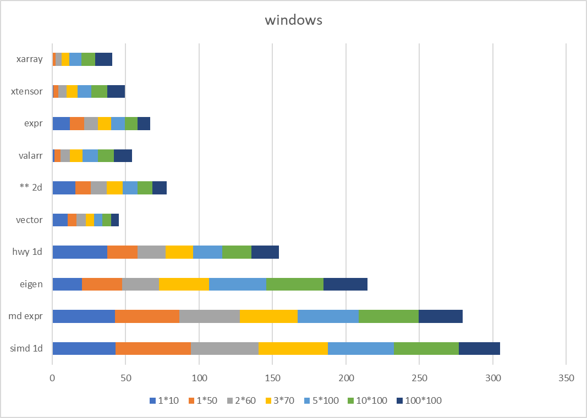
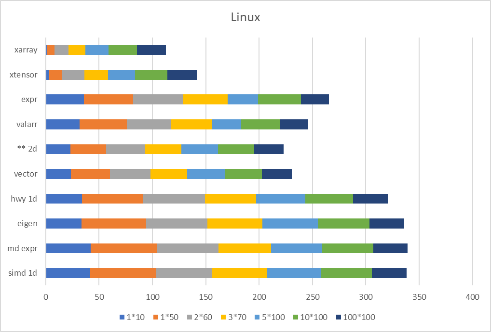
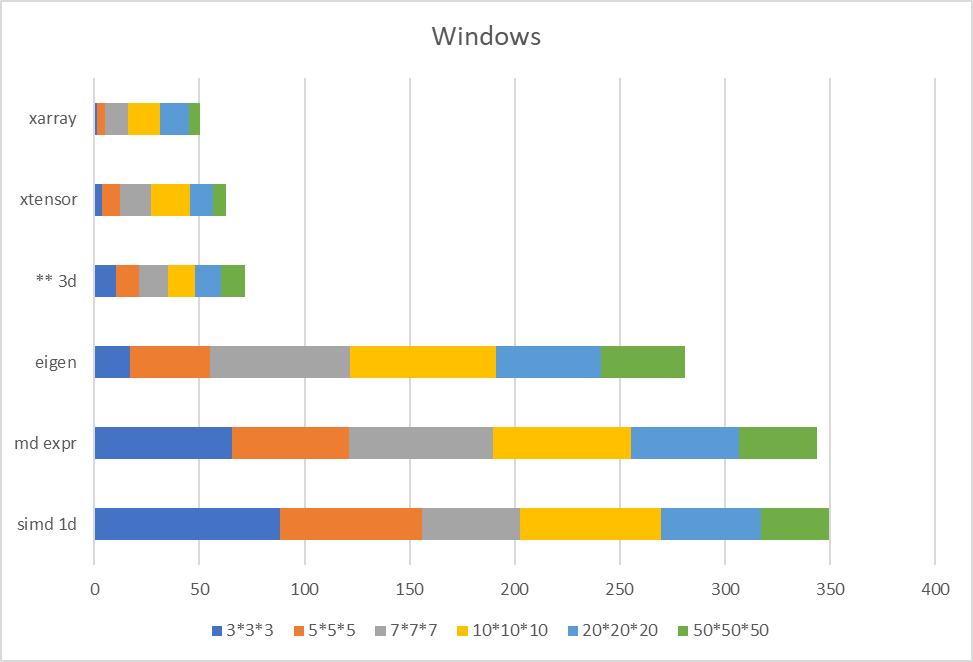
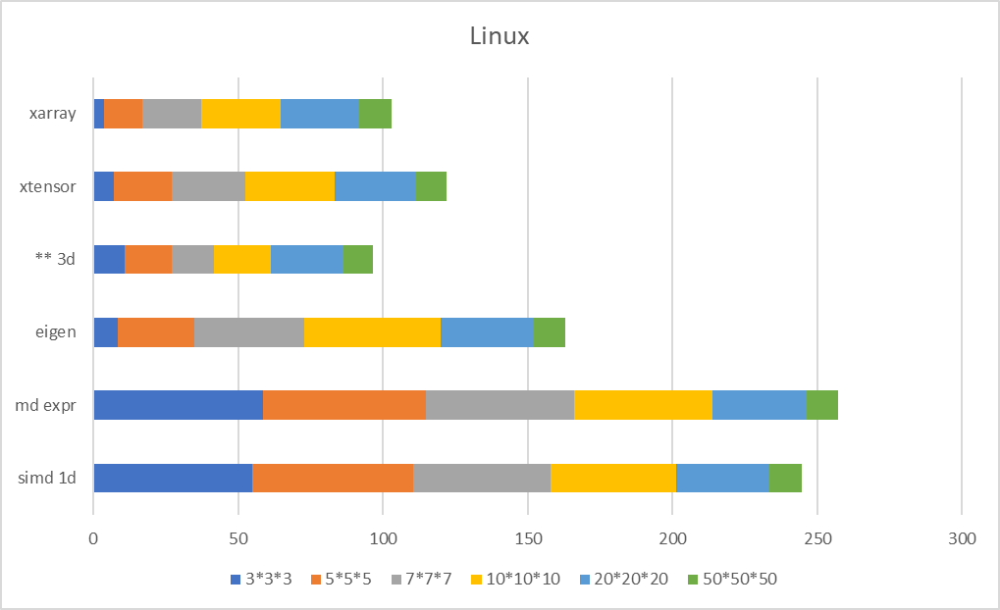

# mdvector - 多维高性能SIMD向量库

**mdvector** 是一个**C++17**标准下、**轻量级头文件**形式、基于现代C++的多维数组计算库，通过 **SIMD指令集优化** 和 **表达式模板技术**，在元素级运算（Element-wise）场景下达到**接近手写汇编极限性能**，同时支持**python风格切片操作**与切片之间高性能计算。

**mdvector** is a **C++17** based **lightweight header-only** multidimensional array computing library based on modern C++. Through **SIMD instruction set optimization** and **expression template techniques**, it achieves **near hand-written assembly performance** in element-wise operations while supporting **Python-style slicing operations** and high-performance computation on slices.


## 🚀 核心特性

### 1. 极致性能优化【已支持】

- **SIMD 全指令集支持**：SSE/AVX2/AVX512（x86）、NEON（ARM）、RISC-V自动适配，内存对齐与尾部掩码处理，相比手写指令集无性能损失
- **表达式模板**：复杂运算（如 `res = a + b - c * d / e`）零临时变量开销

### 2. 多维与视图的灵活操作【已支持】

- **任意维度支持**：通过自定义实现（C++17）实现多维索引功能，对标 `std::mdspan`（C++23）特性
- **安全索引**：`vec.at(d1,d2,d3)`（边界检查）与 **快速索引** `vec(d1,d2,d3)` ，需指出`vec[d1,d2,d3]`形式的[]索引重载需要C++23才能支持
- **惰性视图**：支持自定义指针偏移实现切片（`span`） 切片同样支持高性能表达式模板计算操作

### 3. 内存安全设计【评估中】

- **Rust风格安全证明**：所有 `unsafe` 操作可以绑定维度类型来静态验证
- **编译期形状检查**：通过类型系统确保维度一致性

### 4. 跨平台兼容【已支持】

- **指令集自动适配**：x86/ARM/RISC-V 架构无缝切换
- **编译器友好**：GCC/Clang/MSVC 全支持
- **轻量级**：头文件形式
- **兼容性**：只需要C++17标准即可，无需C++23的标准库mdspan等特性

### 5. 未来特性

- **高性能基础数学函数[已支持]**：集成simd形式高性能三角函数及基础数学函数，扩展mdvector在科学计算领域的适用性
- **更多灵活切片方法**：更多切片方法，如python风格跨步长子视图，以及降维等实用操作
- **更多类型支持**：目前mdvector支持float与double，未来考虑兼容int以及自定义类型（但是会要求类型POD，同时会去掉表达式模板运算功能，保留多维索引与子视图功能）
- **基本科学计算功能扩展**：三维坐标计算、四元数计算等基础功能
- **单头文件使用**：single_include形式，只需引入单个头文件，指令集检测选择内嵌到单头文件代码中，同时提供手动指定指令集功能
- **关于C++23及以上标准**：目前`mdspan`与`span`为自定义实现，给予C++17标准，未来考虑使用C++23及以上标准时，自动替换自定义实现为标准库实现方式
- **接口**：与eigen等库的无开销映射

### 6. 目前不考虑的特性

- **复杂矩阵运算**：GEMM等不在考虑范围，建议使用eigen
- **稀疏矩阵**：同样建议使用eigen、blas、mkl等
- **复杂科学计算**：复数运算、频域计算暂不在考虑范围内

## 📊 性能对比

- **md expr为此项目**
- **hwy为google-highway**
- **expr为基于for循环的表达式模板**

<div align="center">
  
  <p><em>性能对比(越高越好)</em></p>
</div>
<div align="center">
  
  <p><em>性能对比(越高越好)</em></p>
</div>
<div align="center">
  
  <p><em>性能对比(越高越好)</em></p>
</div>
<div align="center">
  
  <p><em>性能对比(越高越好)</em></p>
</div>

## 🚀 示例
1.有限元计算中，根据节点实时三维坐标，更新梁长度信息，

- 常规写法：用vector/结构体储存坐标，然后每个时间步for循环，写法复杂，存在中间变量，且使用AOS，难以simd向量化优化性能，变量多易出错：
  ```
  struct pos3d{
    double x;
    double y;
    double z;
  }
  vector<pos3d> pos_info;
  vector<double> length;
  /// ... 赋值pos_info省略
  /// 每个时间步更新length
  for (int i = 0; i < nodes_num - 1; i++>){
    double x_l = pos_info[i+1].x - pos_info[i].x;
    doubel y_l = pos_info[i+1].y - pos_info[i].y;
    doubel z_l = pos_info[i+1].z - pos_info[i].z;
    length[i] = std::sqrt(std::pow(x_l, 2) + std::pow(y_l, 2) + std::pow(z_l, 2));
  }
  ```
- mdvector方法：使用二维mdvector直接存储，储存十个节点的坐标信息，再创建内存连续视图，每次时间步中只需执行表达式计算，无需中间变量与for循环，且mdvector/span的四则运算为完全simd向量化，性能远高于基础for循环方法:
  ```
  mdvector<double, 2> pos_info({3, nodes_num});
  mdvector<double, 1> length({nodes_num-1});
  /// ... 赋值pos_info省略
  md::span<double, 1> x1 = pos_info.span(0, slice(0, -2));
  md::span<double, 1> x2 = pos_info.span(0, slice(1, -1));
  /// ... y1 y2 z1 z2省略
  /// 每个时间步更新length
  length = (x2-x1)*(x2-x1) + (y2-y1)*(y2-y1) + (z2-z1)*(z2-z1);
  length = length.sqrt();
  ```

## 📦 快速开始

### 使用

- git clone <https://github.com/Burgundytora/mdvector.git>
- cmake中添加次仓库目录 然后include mdvector.h头文件即可 cmake指令集与编译选项参考附带cmake文件夹 或者引入simd的cmake
- 未来会适配single_include形式
