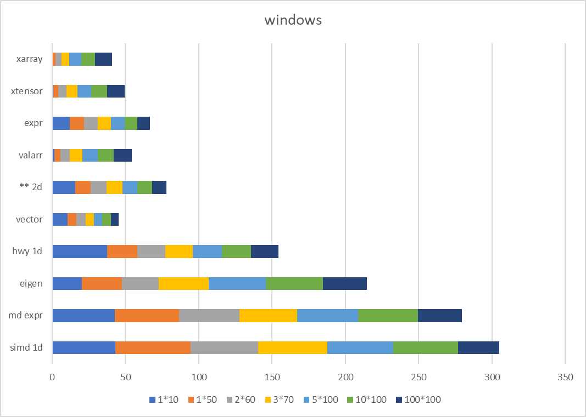
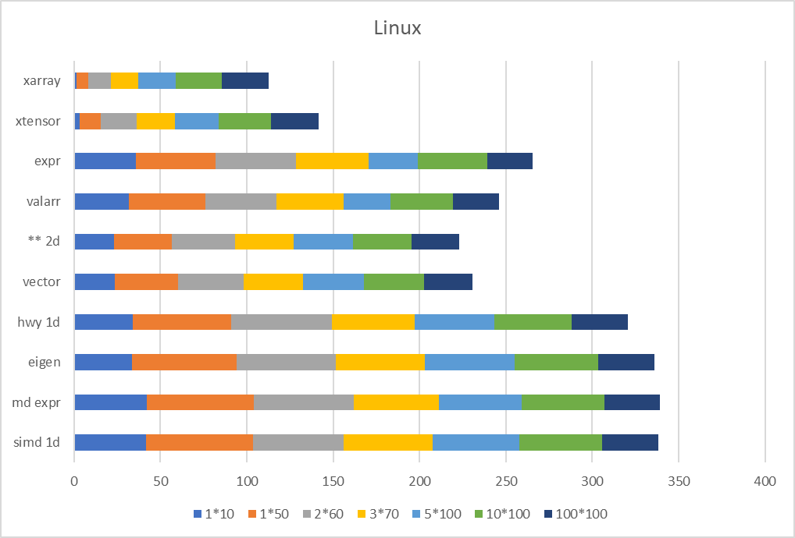
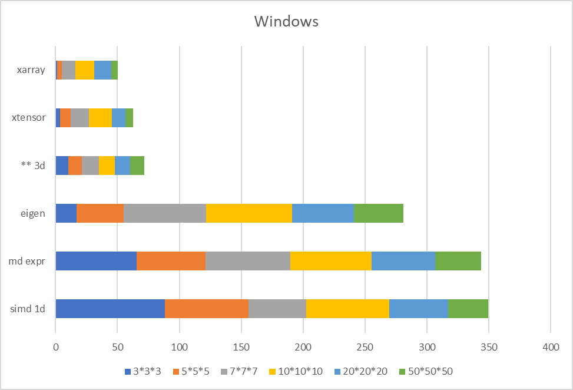
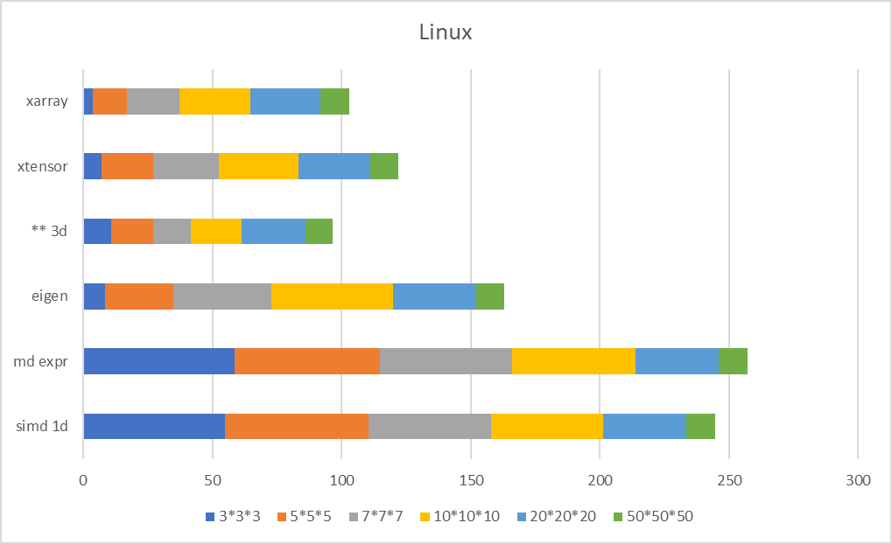

# mdarray - 多维高性能SIMD向量库

**mdarray** 是一个**C++23**标准下、**轻量级头文件**形式、基于现代C++的多维数组计算库，通过 **SIMD指令集优化** 和 **表达式模板技术**，在元素级运算（Element-wise）场景下达到**接近手写汇编极限性能**，同时支持**python风格切片操作**与切片之间高性能计算。

**mdarray** is a **C++23** based **lightweight header-only** multidimensional array computing library based on modern C++. Through **SIMD instruction set optimization** and **expression template techniques**, it achieves **near hand-written assembly performance** in element-wise operations while supporting **Python-style slicing operations** and high-performance computation on slices.

**1.md::vector<type, Rank>**: 堆上多维动态数组，编译期指定维度个数，运行时指定各维度

**2.md::array<type, L1, L2...>**: 栈上多维静态数组，编译期确定维度信息

**3.md::span<type, Rank>**: 内存连续视图，对md::vector进行切片创建

**4.md::view<type, Rank>**: 跨步视图，对md::vector进行切片创建

## 🚀 核心特性

### 1. 极致性能优化【已支持】

- **SIMD 全指令集支持**：SSE/AVX2/AVX512（x86）、NEON（ARM）、RISC-V自动适配，内存对齐与尾部掩码处理，相比手写指令集无性能损失
- **表达式模板**：复杂运算（如 `res = a + b - c * d / e`）零临时变量开销
- **惰性求值**：支持定义零成本复杂表达式，在赋值才才触发具体运算
- **表达式并行计算**：表达式计算及赋值支持手动指定线程，及自动最大线程的并行计算

### 2. 多维与视图的灵活操作【已支持】

- **任意维度支持**：通过自定义实现mdspan（C++17）或std::mdpan（c++23）实现多维索引功能
- **灵活布局支持**：支持layout_left、layout_right、layout_stride多种布局，满足常规行优先/列优先使用场景
- **安全索引**：`vec.at(d1,d2,d3)`（边界检查）与 **快速索引** `vec(d1,d2,d3)` `vec[d1,d2,d3]` ，需指出`vec[d1,d2,d3]`形式的[]索引重载需要C++23才能支持
- **内存连续视图**：支持自定义指针偏移实现内存连续切片（`span`）， 切片同样支持高性能表达式模板/数学函数计算操作，内存连续视图的计算、取值与赋值
- **跨步视图**：支持切片（`view`）， 切片同样支持高性能表达式模板/数学函数计算操作

### 3. 内存安全设计【评估中】

- **Rust风格安全证明**：所有 `unsafe` 操作可以绑定维度类型来静态验证
- **维度检查功能**：提供维度是否完全一致的检查功能
- **编译期形状检查**：通过类型系统确保维度一致性

### 4. 跨平台兼容【已支持】

- **指令集自动适配**：x86/ARM/RISC-V 架构无缝切换
- **编译器友好**：GCC/Clang/MSVC 全支持
- **轻量级**：头文件形式
- **兼容性**：最低只需要C++17标准即可(cpp17分支)，目前主干已切换至C++23

### 5. 数学函数【已支持】

- **三角函数**：四种多维容器都支持常见三角函数
- **统计函数**：四种多维容器都支持常见统计函数
- **其他STL函数**：支持其他STL函数，如 hypot isnan crbt等

### 6. 未来特性

- **更多类型支持**：目前mdarray支持float double与int，未来考虑兼容long int以及自定义类型（但是会要求类型POD，同时会去掉表达式模板运算功能，保留多维索引与子视图功能）
- **基本科学计算功能扩展**：三维坐标计算、四元数计算等基础功能
- **单头文件使用**：single_include形式，只需引入单个头文件，指令集检测选择内嵌到单头文件代码中，同时提供手动指定指令集功能
- **接口**：与eigen等库的无开销映射
- **表达式自由优化**：通过算术符系统，对表达式进行重排优化
- **数学函数表达式模板化**：支持常用一元与二元数学函数的表达式模板计算，进一步实现极致性能
- **线性代数**：目前正在基于本仓库进行linalg线性代数库开发(<https://github.com/WangHu1996/linalg.git>)

## 🚀 示例

1.有限元计算中，根据节点实时三维坐标，更新梁长度信息，

- 常规写法：用vector/结构体储存坐标，然后每个时间步for循环，写法复杂，存在中间变量，且使用AOS，难以simd向量化优化性能，变量多易出错：

  ```
  struct pos3d{
    double x;
    double y;
    double z;
  }
  vector<pos3d> pos_info;
  vector<double> length;
  /// ... 赋值pos_info省略

  /// 每个时间步更新length 需要循环 定义临时变量
  for (int i = 0; i < nodes_num - 1; i++>){
    double x_l = pos_info[i+1].x - pos_info[i].x;
    doubel y_l = pos_info[i+1].y - pos_info[i].y;
    doubel z_l = pos_info[i+1].z - pos_info[i].z;
    length[i] = std::sqrt(std::pow(x_l, 2) + std::pow(y_l, 2) + std::pow(z_l, 2));
  }
  ```

- mdarray方法：使用二维数组直接存储，储存十个节点的坐标信息，再创建内存连续视图，每次时间步中只需执行表达式计算，无需中间变量与for循环，且内置vector/span的四则运算为完全simd向量化，性能远高于基础for循环方法:

  ```
  md::vector<double, 2> pos_info({3, nodes_num});
  md::vector<double, 1> length({nodes_num-1});
  /// ... 赋值pos_info省略
  md::span<double, 1> x1 = pos_info.span(0, slice(0, -2));
  md::span<double, 1> x2 = pos_info.span(0, slice(1, -1));
  /// ... y1 y2 z1 z2省略
  
  /// 每个时间步更新length 仅调用平方根函数
  length = hypot(x2 - x1, y2 - y1, z2 - z1);
  ```

## 📊 性能对比

- **md expr为此项目**
- **hwy为google-highway**
- **expr为基于for循环的表达式模板**

<div align="center">
  
  <p><em>性能对比(越高越好)</em></p>
</div>
<div align="center">
  
  <p><em>性能对比(越高越好)</em></p>
</div>
<div align="center">
  
  <p><em>性能对比(越高越好)</em></p>
</div>
<div align="center">
  
  <p><em>性能对比(越高越好)</em></p>
</div>

## 📦 快速开始

### 使用

- git clone <https://github.com/Burgundytora/mdarray.git>
- 未来会适配single_include形式
